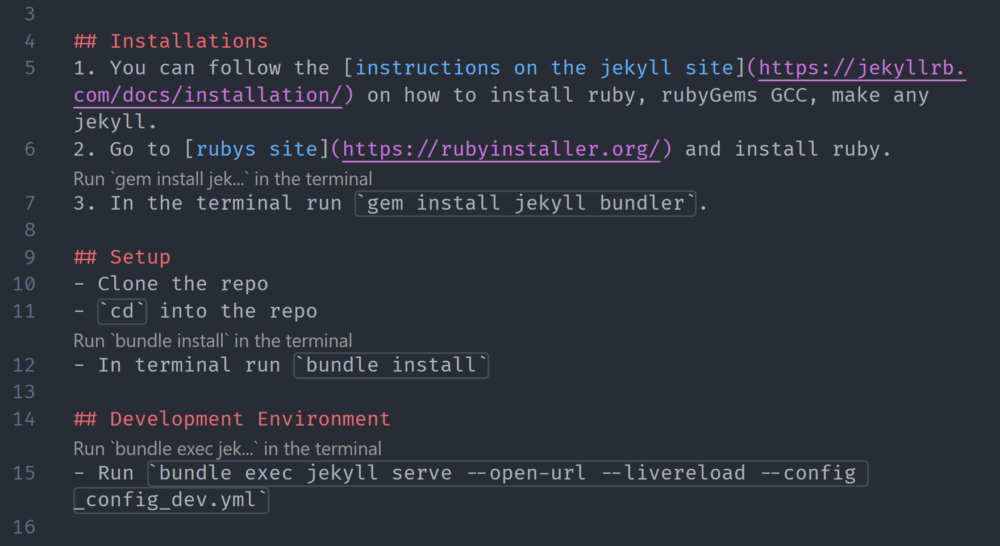

# Command Runner

With this extension, you can run code snippets from markdown and plaintext files with powerful customization options.



## Requirements

- Visual Studio Code 1.48+

## How to Use

- By default the extension is enabled, you can toggle it using the command palette. Trigger the command palette (Ctrl / Cmd + Shift + P) -> Command Runner: Enable / Disable.
- Once it is enabled, above every line that contains the word 'run' followed by a code snippet (e.g. run ````npm -V````) appears a button to execute the command.

### Basic Syntax

**Default terminal:**
````markdown
run `npm install`
````

**Named terminal** (all commands with the same name go to the same terminal):
````markdown
run test`npm test`
run build`npm run build`
run server`node app.js`
````

**Custom display name** (personalize what appears in the CodeLens button):
````markdown
run `npm install`(Install Dependencies)
run `npm test`(Run Tests)
run `npm run dev`(Start Dev Server)
````

Simply write any name before the backticks to create or reuse a named terminal. If no name is provided, commands run in the default "Command Runner" terminal. Add text in parentheses after the command to customize the button display name.

### Examples

````markdown
# Quick commands (default terminal)
run `node --version`
run `npm -v`

# Organized workflows (named terminals)
run dev`npm run dev`
run test`npm test -- --watch`
run build`npm run build`
run lint`npm run lint`

# Custom display names
run `npm install`(Install)
run `npm test`(Test Suite)
run `npm run dev`(Dev Server)
run `npm run build`(Build Project)
run `git status`(Git Status)

# Combining named terminals with custom display
run dev`npm run dev`(Start Development)
run test`npm test -- --watch`(Watch Tests)
````

## Features

- Works in **Markdown** and **Plain Text** files
- Simple syntax: just add a name before backticks
- Named terminals persist - reuse them for related commands
- Supports single (````), double (``````), and triple (``````````) backticks
- **Custom display names** - personalize button text with parentheses syntax
- Use descriptive names for better visual organization
- ▶︎ symbol always visible for quick identification

## To-Dos

- [ ] Work with two runnables on one line.
- [ ] Add support for multi-line code blocks with multiple runnables.
- [ ] Support custom regex expressions.
- [ ] Add language filters.

## Release Notes

### 0.3.0

- **NEW:** Custom display names using parentheses syntax: ````run `command`(Custom Name)````
- Button shows only ▶︎ symbol + custom name when specified
- Supports descriptive text for better organization
- Works with both default and named terminals

### 0.2.0

- Added support for named terminals
- Extension now activates in any file
- Simplified syntax: any text before backticks becomes the terminal name

### 0.1.0

- Initial release